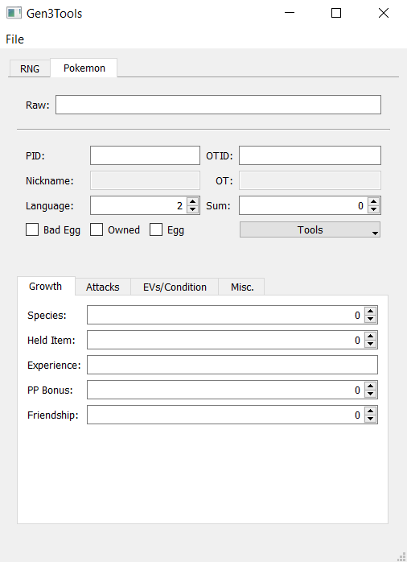

# Gen3Tools

Tools for TASing and data analysis of Gen 3 Pokemon games.

This is a general repo for all of my Pokemon glitch research docs.

Most of it is disorganized, but there is a GUI gen 3 editor and RNG tool:



Other potentially useful files:
* [Gen 3 RNG library](seed.py)
* [Python data structures for Gen 3 Pokemon](pokemon.py)
* ACE codes for [Japanese](jpn.md) and [English](us.md) Emerald
* [Various](emerald-jp.lua) [TAS](emerald-us.lua) [scripts](button_input.lua)
* Unfinished [Japanese Ruby](ruby-jp.md) research

## Installation
Download the .exe from the [releases](https://github.com/arantonitis/gen3tools/releases/latest).

or, clone the repo and install Python and PyQt5:
```bash
git clone https://github.com/arantonitis/gen3tools
cd gen3tools
python3 -m pip install PyQt5 --user
python3 gui.py
```

## Other Resources
* Various decomps at [pret](https://github.com/pret)
* [My Pastebin](https://pastebin.com/u/merrp)
* [Glitch City Research Institute Discord](https://discord.gg/hMU5ejpcpm)